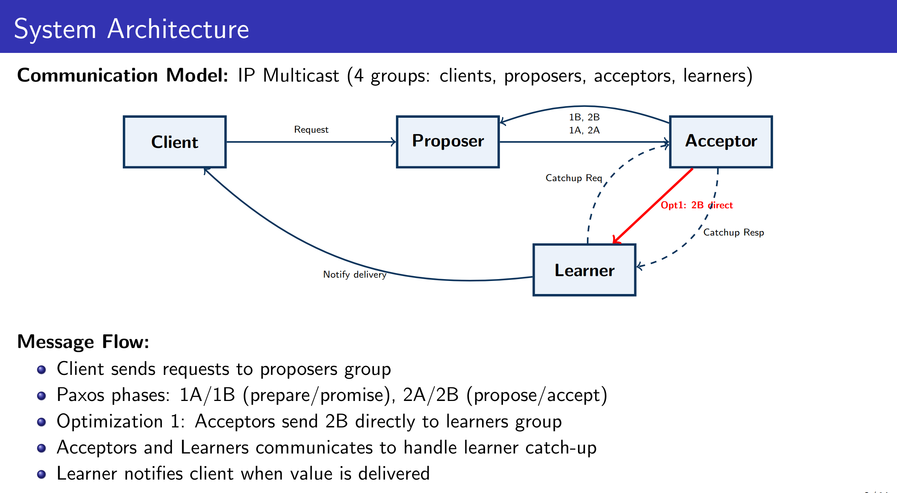

# Distributed Algorithms: Paxos implementation

The implementation is accomplished through three milestones:
1) Synod algorithm
2) Multi Paxos
3) Optimizations




## Dependencies and preliminaries

The bash scripts can be runned from a clean Ubuntu 24.04 image. You may need `sudo` access to run the scripts.

Some of the scripts use `iptables` to simulate message loss through firewall rules. Adding these rules on your local machine is risky, as they greatly impact the performance of the network communication. The suggestion is to run everything inside a virtual machine (e.g., with `multipass`).

Depending on the network interface used, ip multicast might not be enabled. You can check using `ifconfig` and checking that the "MULTICAST" flag is set. You *might* have to enable it using:

```
ifconfig IFACE multicast
```

where `IFACE` is the name of the interface. Using a connected cable/wifi interface probably will not have this problem (e.g. "eth0", "wlan0").

## How to run the tests

1. `cd` to this directory. All the scripts should be run from here. Make sure the scripts in the `scripts` folder have executable permissions.

2. Perform a run and check the results as follows:
```
scripts/run.sh -n 1000
scripts/check.sh
```

3. Once `gnuplot` is installed with `sudo apt install gnuplot`, you can collect latency data and plot it with the following commands:
```
scripts/run.sh -n 1000 -l 0
gnuplot scripts/plotting/cdf.gp
gnuplot scripts/plotting/cartesian.gp
```
These will generate the two plots in the logs folder. Not that clients need to learn the values to compute the latencies. Reset the corresponding flag in the client to disable this feature: then, only the learners will learn.

## Caveats/Tips

1. The scripts will try to `pkill` your processes (SIGTERM). You might need to "flush" the output of your learners to make sure values are printed when learned.

2. The scripts have many parameters to test for different cases:
    - `-n X` allows each client to generate `X` values
    - `-d` enables debug
    - `--loss X` drops `X`% (e.g., `0.1`) of sent messages
    - `--catchup` starts a late learner to test catchup
    - `-s` sets the sleep time used in the scripts: it may be increased if a lot of values are sent
    - `--ip` changes the default multicast ip address (`239.1.2.3`)
    - `-c` sets the number of clients
    - `-p` sets the number of proposers
    - `-a` sets the number of acceptors
    - `-l` sets the number of learners

3. In case you specify a loss probability and kill the script, you may need to manually remove the firewall rule. Run `scripts/cleanup.sh` to cleanup. You can check the active rules with `sudo iptables -L INPUT -v --line-numbers`.

4. If you started a run, but then you stopped it with `Ctrl+C`, it is a good idea to close the current terminal and reopen another one, since some processes may still be running and they may still send/receive messages for a new run.

## What is Paxos?

Paxos is a protocol used to solve consensus in asynchronous systems. Simply put, consensus can be used by a set
of processes that need to agree on a single value. More commonly though, processes need to agree on a sequence
of totally ordered values - a problem known as atomic broadcast.

In this implementation, four roles are provided:

- clients: submit values to proposers
- proposers: coordinate Paxos rounds to propose values to be decided
- acceptors: Paxos acceptors
- learners: learn about the sequence of values as they are decided

The protocol always guarantees safety. To guarantee liveness, in a complete Paxos implementation, one of
the proposers should be elected as the leader. For simplicity, in this project, the 
leader election oracle is not implemented. However, no assumptions are made about which proposer is the leader, and more than one proposer. Therefore, if two proposers are proposing in parallel and preventing each other from executing Phase 2 of the protocol, they will keep trying until one of them succeeds.

## Assumptions

We assume only crash failures. That is, processes fail by halting and do not recover. This allows the following
simplifications:
- no need to implement a recovery procedure for acceptors or learners
- all state can be kept in memory - no need to use stable storage
Implementation
## Implementation Details: 

Based on IP multicast only and supports four different multicast groups, one for each role of the protocol.
We followed 3 milestones for the implementation:
1. Synod algorithm: the basic version of Paxos. It supports the decision of a single value.
2. MultiPaxos: an extension of the Synod algorithm to support atomic broadcast. It supports the decision of
multiple values in the same total order.
3. Optimizations: we will focus on 3 of them:
    - One communication step is saved by allowing acceptors to send the PH2B messages directly to the learners.
    - Two more communication steps are saved on the critical path by the proposers performing PHASE1 before
receiving the value from the clients.
    - With batching, more values can be decided in a single instance of the Synod algorithm.
Also, the implementation guarantees the following:
        - message loss or processes crashing should never violate safety (total order, agreement or integrity)
        - if a majority of acceptors are killed, no progress should be made (asynchronous consensus assumption)
        - learning values must be possible if there are a majority of acceptors and 1 of each other role (no crashes or
message loss)
